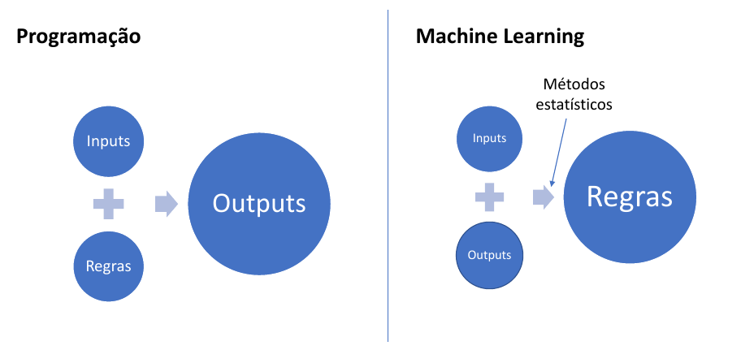
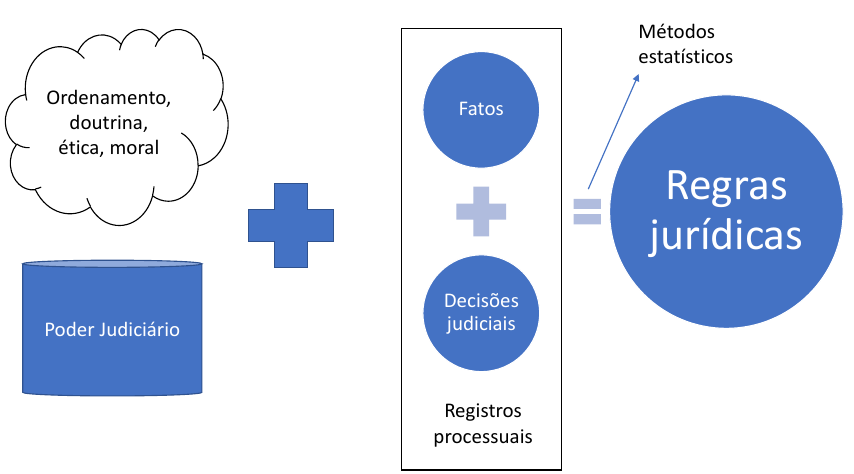
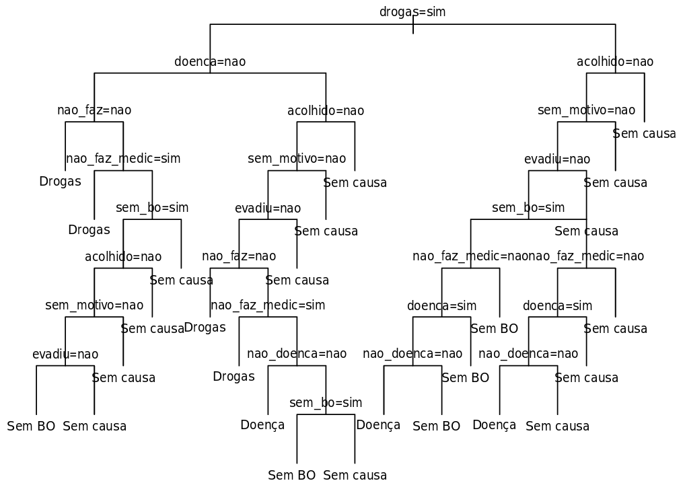
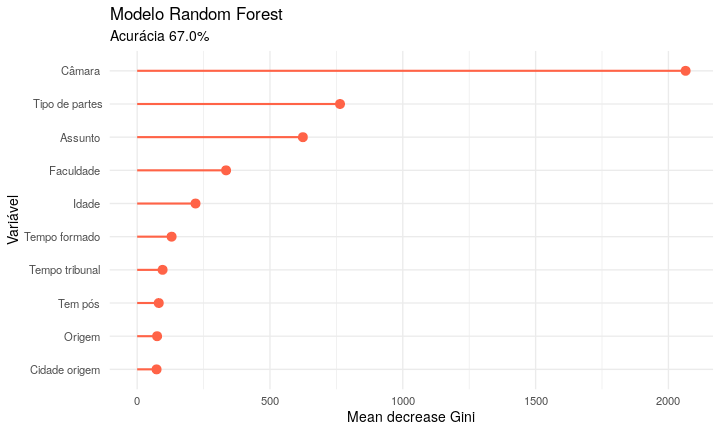
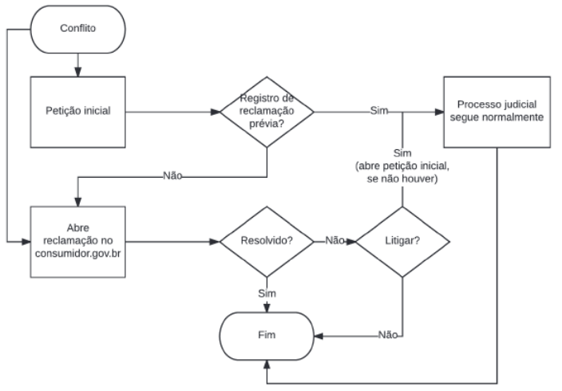

```{r, include=FALSE}
knitr::opts_chunk$set(echo=FALSE)
```


# Inteligência Artificial (hoje)

```{r}

```

---

# Jurimetria

```{r}

```

---

# Impactos da Jurimetria no Direito

### Redefinição de ordem jurídica 

--

### Redefinição de regras jurídicas 

- Normas induzidas do coordenamento (registros dos tribunais) 
- Existem leis que "pegam" e leis que "não pegam"
- Lacunas, antinomias e iniquidade 

--

### Relevância central da prestação jurisdicional 

- Regras jurídicas dependem das condições de sua aplicação 

--

### Teoremas jurimétricos 

- Modelo de litígio de Priest and Klein

---
class: inverse, center, middle

# Onde Jurimetria e IA se encontram?

---

# Aplicações de IA no Direito

Inteligência Artificial pode ser utilizada no Direito com ou **sem** a finalidade jurimétrica mais pura.s

**Exemplo**: algoritmo de classificação de texto (com IA).

**Finalidade 1**: otimização de mecanismo de busca de jurisprudência.

**Finalidade 2 (jurimetria)**: análise das teses com melhor aceitação.

---

# Aplicações de IA no Direito

Inteligência Artificial pode ser utilizada no Direito **com** ou sem a finalidade jurimétrica mais pura. 

**Exemplo**: algoritmo de previsão de decisões com base em documentos.

**Finalidade 1**: otimização de mecanismo de busca de jurisprudência.

**Finalidade 2 (jurimetria)**: indução das regras jurídicas subjacentes com base no modelo.

---
class: center

# Exemplo: Pessoas desaparecidas

```{r, out.width="80%"}

```

http://bit.ly/abj-desap

---
class: center

# Exemplo: Condicionantes para decisões

```{r}

```

https://abjur.github.com/slides/fgv

---
class: center

# Exemplo: Maiores litigantes

```{r, out.width="80%"}

```

https://abj.org.br/cases

---

# Reflexões finais

### Foco no problema, não no algoritmo

--

### Jurimetria e IA se encontram em dois pontos principais

- Processamento de dados 
- Métodos de inferência 

--

### Grandes impactos no direito e na sociedade

- Caracterização empírica da lei 
- Automação em larga escala

---

# Obrigado!

### Email

[jtrecenti@abj.org.br](mailto:jtrecenti@abj.org.br)

### Contato (Telegram, Twitter, GitHub)

@jtrecenti

### Site

https://abj.org.br

### Apresentação 

https://abjur.github.io/slides/mprj


