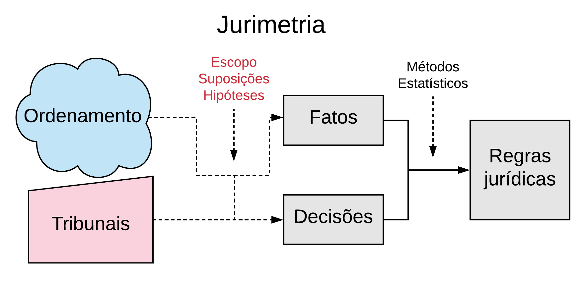
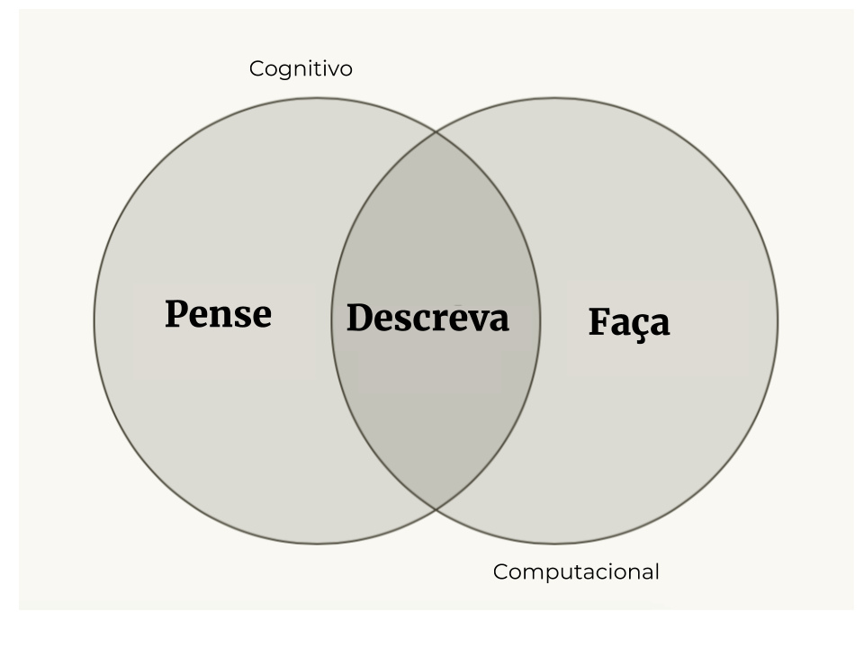
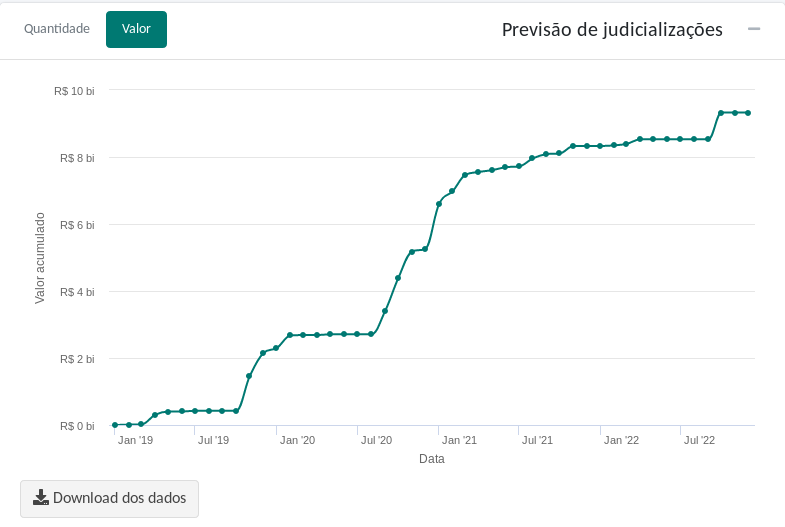
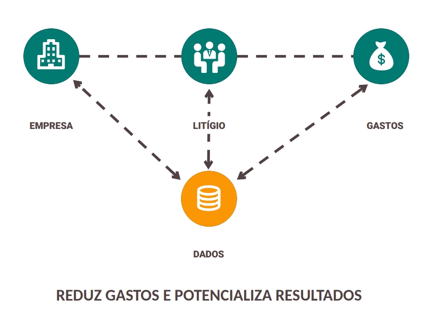
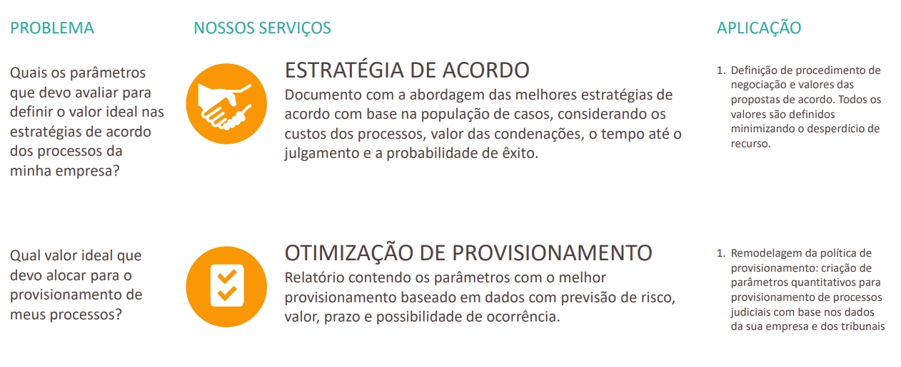
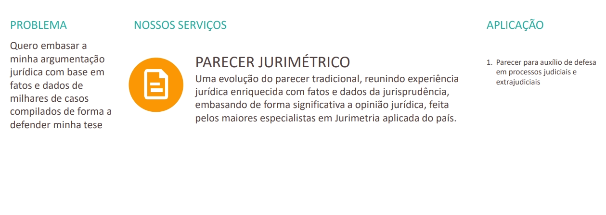
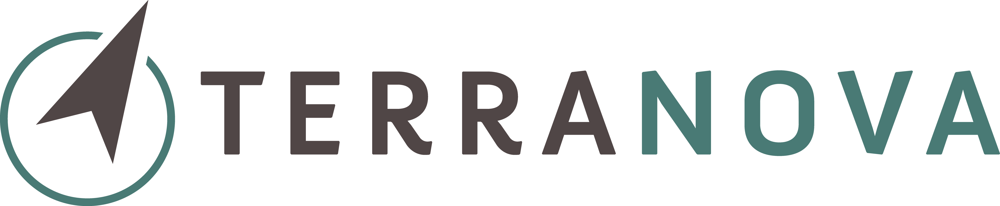

```{r, include = FALSE}
knitr::opts_chunk$set(echo=FALSE, 
                      message=FALSE, 
                      warning=FALSE,
                      fig.align = "center",
                      out.width="100%")
```

class: middle

# 

## jurimetria não é software

--

## a solução é tão complexa quanto o problema

--

## fale com um especialista

---

class: inverse, middle, center

# jurimetria não é software

<html>
  <div style='float:left'></div>
  <hr color='#43BF71' size=1px width=720px>
</html>

---

# Paradigma programação / aprendizado

```{r}
knitr::include_graphics("img/inputs_regras.png")
```

---

# Na jurimetria não é diferente

```{r}
knitr::include_graphics("img/jurimetria1.png")
```

---

# jurimetria não é software!

```{r}

```

---

# Em resumo

```{r, out.width="90%"}

```

---

class: inverse, middle, center

# a solução é tão complexa quanto o problema

<html>
  <div style='float:left'></div>
  <hr color='#43BF71' size=1px width=720px>
</html>

---

# Exemplo 1: Média

```{r, out.width="80%"}
knitr::include_graphics("img/camaras.png")
```

---

# Exemplo 2: Projeção de carteira

```{r}

```

---

# Exemplo 3: Danos morais

```{r}
knitr::include_graphics("img/danos_morais.png")
```

---

class: inverse, middle, center

# fale com um especialista

<html>
  <div style='float:left'></div>
  <hr color='#43BF71' size=1px width=720px>
</html>

---

# Como podemos ajudar?

```{r}

```

---

# Serviços

```{r}
knitr::include_graphics("img/servicos-1.png")
```

---

# Serviços

```{r}

```

---

# Serviços

```{r}

```

---

# Como trabalhamos?

```{r}
knitr::include_graphics("img/ciclo-ciencia-de-dados.png")
```

---
class: middle, center

# Obrigado!

.pull-left[

```{r, out.width="50%"}

```

__Contato__: [jtrecenti@abj.org.br](mailto:jtrecenti@abj.org.br)

__Site__ ABJ: https://abj.org.br

]

.pull-right[

```{r, out.width="90%"}

```


__Contato__: [jtrecenti@trnv.com.br](mailto:jtrecenti@trnv.com.br)

__Site__ Terranova: https://trnv.com.br


]


