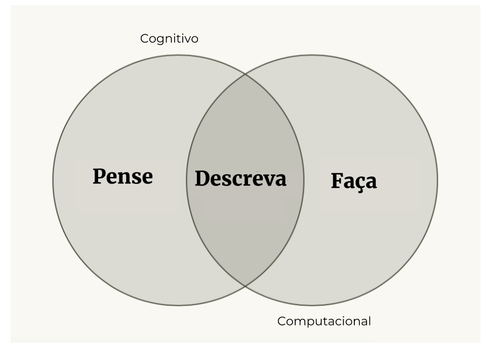
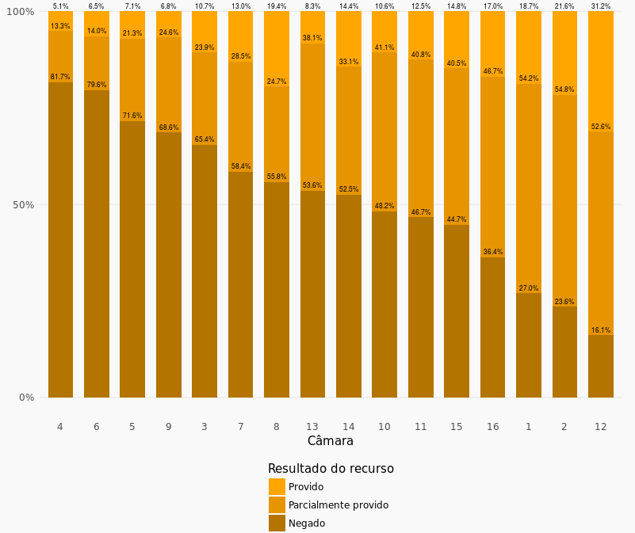

```{r, include = FALSE}
knitr::opts_chunk$set(echo=FALSE, 
                      message=FALSE, 
                      warning=FALSE,
                      fig.align = "center",
                      out.width="100%")
```

class: middle

# 

## jurimetria não é software

--

## a solução é tão complexa quanto o problema

--

## fale com especialistas

---

class: inverse, middle, center

# jurimetria não é software

<html>
  <div style='float:left'></div>
  <hr color='#43BF71' size=1px width=720px>
</html>

---

# Paradigma programação / aprendizado

```{r}
knitr::include_graphics("img/inputs_regras.png")
```

---

# Na jurimetria não é diferente

```{r}
knitr::include_graphics("img/jurimetria1.png")
```

---

# jurimetria não é software!

```{r}
knitr::include_graphics("img/jurimetria2.png")
```

---

# Em resumo

```{r, out.width="90%"}

```

---

class: inverse, middle, center

# a solução é tão complexa quanto o problema

<html>
  <div style='float:left'></div>
  <hr color='#43BF71' size=1px width=720px>
</html>

---

# Exemplo 1: Média

```{r, out.width="80%"}

```

---

# Exemplo 2: Projeção de carteira

```{r}
knitr::include_graphics("img/judicializacoes.png")
```

---

# Exemplo 3: Danos morais

```{r}
knitr::include_graphics("img/danos_morais.png")
```

---

class: inverse, middle, center

# fale com especialistas

<html>
  <div style='float:left'></div>
  <hr color='#43BF71' size=1px width=720px>
</html>

---

# Como trabalhamos?

```{r}
knitr::include_graphics("img/ciclo-ciencia-de-dados.png")
```

---

# Dados abertos

## listas abertas distribuições, classe e assunto

## APIs públicas já existem!

## A importância do Selo e do MNI

---
class: middle, center

# Obrigado!

.pull-left[

```{r, out.width="50%"}
knitr::include_graphics("img/abj_logo.png")
```

__Contato__: [jtrecenti@abj.org.br](mailto:jtrecenti@abj.org.br)

__Site__ ABJ: https://abj.org.br

]


